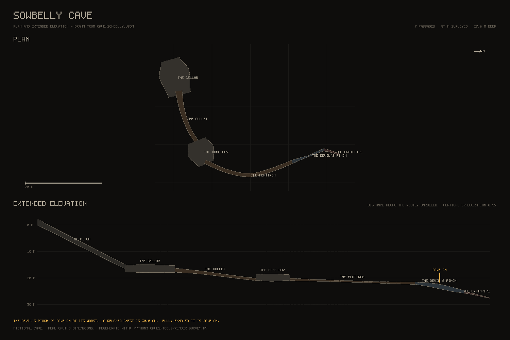

# Sowbelly

Caving in the places that are too small. Godot 4.7, exported to HTML5 / WebXR, played on a
desktop browser, a phone or a Quest 3. A sibling to [Derelict Orbit](../README.md), built on
the same machinery: the same WebXR bootstrap, the same SurfaceTool batcher, the same
generate-everything-at-startup discipline, and no third-party assets of any kind.

**You are a shape that has to fit.** Not a capsule that bumps into things - a height, a
shoulder span and a chest depth, folded into whatever the passage allows. The ceiling decides
whether you stand, stoop, crawl or go flat, and it decides without asking you. The only
choice that is really yours is whether to go tighter than you have to, and how much air is in
your chest when you do.

**Your chest is thirty centimetres deep.** At the bottom of a full exhale it is twenty-six and
a half, and it will stay there about six seconds before your body takes the decision back.
Three and a half centimetres is not much. It is the difference between the Devil's Pinch being
a passage and being a wall, and it is the whole game.

**The cave is lit, for now.** It was built to be pitch black with a headlamp as the whole of
your vision, and that is still in there - `Cave.lit = false` in `scripts/cave_game.gd` restores
it. But you cannot judge whether a squeeze reads, or whether a passage goes where you think it
does, through a fifteen degree cone, so while the movement is being played with there are fill
lights down every passage and the headlamp is not load-bearing. Twenty-eight metres down, past
a rope, two small rooms, a hands-and-knees tube and twenty-four metres of flattened bore, the
passage narrows to twenty-eight and a half centimetres, and you have to decide.

**Most of it is too small to stand up in.** There are exactly two places in the cave where you
can, and neither is bigger than a garage. Everything between them is a bore that only ever
narrows - and the only thing that is not round is the slot at the bottom, which is the point.

Nothing down here is hunting you. Nothing is counting down. Getting wedged is not a death, it
is a puzzle: you got held at a particular shape, and the way out is to become a smaller one.



*Plan and extended elevation, drawn by `tools/render_survey.py` from the same JSON the game
loads. 7 passages, 87 m surveyed, 27.6 m deep.*

## The route

You begin already clipped on to the rope, three metres down the shaft, with rock all round you.

| | Passage | What it is | Length | Tightest | What it teaches |
|---|---|---|---|---|---|
| 1 | **The Pitch** | 17 m shaft, tapering 2.3 → 1.7 m, rigged with one rope | 16.8 m | — | going down, and how far down that is |
| 2 | **The Cellar** | a room at the foot of the rope, 9 × 5, roof 3.0 | 9.5 m | — | standing up, and turning round |
| 3 | **The Gullet** | phreatic tube, dissolved round, bending down | 15.5 m | 0.92 × 0.88 m | hands and knees, without being asked |
| 4 | **The Bone Box** | the other room, 7 × 4.5, roof 2.8 | 6.5 m | — | the last place you stand up |
| 5 | **The Flatiron** | the same tube, flattened, 51 cm at its worst | 24.1 m | 0.91 × 0.51 m | flat out, and what contact feels like |
| 6 | **The Devil's Pinch** | a joint pulled open: tall, and 28.5 cm wide | 9.4 m | **0.285 m** | turning sideways and emptying your chest |
| 7 | **The Drainpipe** | a lead that pinches shut 48 % of the way in | 4.9 m | closes | committing, and backing out |

**The tunnels are bores, and they only ever get tighter.** Every passage between the two rooms
is round, no wider than about twice its height, and narrower than the one before it. There is
nowhere in any of them you can stand up — `check_fit.py` fails the build if there is.

The two rooms are the exception, and they are the only one: a room here is not a different kind
of object either - it is a short passage with a big cross-section.
That is the whole of the cave's structure, and it is deliberate: see
[docs/CAVE.md](docs/CAVE.md) for why two kinds of object turned out to be one kind too many,
and for the one rule that joins them.

Sowbelly is fictional. The geology, the passage types, the vocabulary and the dimensions come
from real caving; the cave and everything in it is invented. It is not a model of any real
cave and it does not restage anything that happened in one.

## Controls

**Desktop**

| Input | Action |
|---|---|
| WASD | move |
| Mouse | look |
| **Shift (hold)** | **empty your chest** - the only way through the Devil's Pinch |
| Ctrl / C | fold down one posture tighter than the ceiling demands |
| Space | stand back up, if there is room |
| Right mouse | take hold of the rock in front of you; drag to haul yourself along it |
| Alt (hold) | brake - on the rope, and generally hold still |
| R | clip on to the rope, or off it |
| F / G | headlamp / hand torch |
| Tab | survey slate |
| Esc | release the mouse |

**Quest 3 (Touch controllers)**

| Input | Action |
|---|---|
| Left stick | move |
| Right stick left / right | snap turn 30° |
| **Either trigger (hold)** | **empty your chest** |
| Grip | take hold of the rock the hand is touching; move the hand to pull yourself |
| Left stick click / B | fold down one posture |
| Right stick click | stand back up |
| A / X | headlamp |
| Y | survey slate |

Crouching for real crouches you in the cave: your headset's height maps onto the posture band,
and the stick click takes you lower than your living room allows. Push your head into rock and
the view fades to black rather than showing you the inside of the world.

**Phones and tablets (held sideways)** - the title screen shows **PLAY** on a touch device.
Android Chrome goes fullscreen and locks to landscape; an iPhone keeps its browser bars.

| Touch | Action |
|---|---|
| Left thumb, anywhere lower left | move - the stick centres where your thumb lands |
| Drag on the right | look |
| Press and hold on rock | take hold of it (the ring fills, the phone buzzes), then drag to haul |
| **EXHALE (hold)** | **empty your chest** - the biggest button on the screen, because it is the one you will need in a hurry |
| LOW / HIGH | posture |
| BRAKE, ROPE, LAMP, SLATE | as above |

**Low graphics** is on by default on touch devices: the 3D view renders at about 1100 px
across, no MSAA, a 1024 shadow map, and no headlamp shadow.

## The body

The whole game is this table. Nothing outside it decides how big you are.

| Posture | Fits a gap | Across | Speed | Eye |
|---|---|---|---|---|
| Standing | 1.75 m | 0.46 m | 1.40 m/s | 1.62 m |
| Stooping | 1.25 m | 0.46 m | 1.00 m/s | 1.12 m |
| Hands and knees | 0.75 m | 0.46 m | 0.75 m/s | 0.58 m |
| Flat out | **chest + 4 cm** | 0.46 m | 0.34 m/s | 0.19 m |
| Committed, sideways | 1.25 m | **chest + 0.5 cm** | 0.13 m/s | 1.10 m |
| Head first, one arm ahead | **chest + 2 cm** | 0.32 m | 0.10 m/s | 0.17 m |

Chest depth is 30.0 cm relaxed and 26.5 cm fully exhaled. Where the table says *chest*, that
is the dimension the exhale acts on - and the reason the Devil's Pinch, at 28.5 cm, refuses a
relaxed body and admits an emptied one with 2 cm to spare.

Posture is chosen for you, from the ceiling. In a real cave nobody decides to crouch; the rock
decides, and the only interesting choice left is whether to go lower still. Standing back up
waits for 9 cm of clear extra headroom, or a passage hovering around 75 cm has you bobbing on
and off your knees twice a second.

See [docs/MOVEMENT.md](docs/MOVEMENT.md) for how contact pressure, wedging and the squeeze
solver work, and what VR in a 28 cm slot costs.

## Project layout

```
project.godot          GL Compatibility renderer (required for web), XR shaders on, gravity 9.8
export_presets.cfg     Web preset: thread support OFF -> runs from any static HTTPS host
scenes/main.tscn       9-node skeleton; the cave and everything in it is built in code
scripts/cave_game.gd   autoload `Cave`: session state, settings, the input map
scripts/sfx.gd         autoload `Sfx`: the sound bank, plus the pressure-driven scrape loop
                       and the exertion-driven breathing that sit under everything
scripts/main.gd        WebXR session, title, environment, quality, the shader warm-up tour,
                       and the four headless autotests
scripts/intent.gd      the input layer: one struct, four producers (desktop, touch, VR, tests),
                       one consumer. Derelict Orbit never had this and it is the main
                       structural change
scripts/caver.gd       the body in the world: gravity, movement gated by contact, climbing by
                       hand, the head, the fade and the vignette
scripts/body.gd        the shape that has to fit: postures, breath, the clearance rings,
                       contact pressure, wedging. Every number in the game is in here
scripts/cave.gd        reads cave/sowbelly.json, sweeps it, chunks it at 20 m, hangs colliders
scripts/bore.gd        one passage: centreline + profile keyframes -> stations -> geometry
scripts/geo.gd         SurfaceTool batcher (from Derelict Orbit) + cross-sections, levelled
                       frames along a bending centreline, and the sweep that joins them
scripts/cave_tex.gd    a library of rock, with free normal maps. Sowbelly uses one of them:
                       wet limestone, on every surface from the roof to the floor
scripts/palette.gd     the handful of materials the whole cave is drawn with, including
                       the double-sided one the junction lips use
scripts/lamp.gd        the headlamp: a hot narrow beam, a dim wide flood, dust in both
scripts/slate.gd       the survey slate: depth, distance, posture, chest, breath left
scripts/rope.gd        the rope down the Pitch: clip on, descend against a brake, climb back
cave/sowbelly.json     the cave itself - read by the game AND by both Python tools
audio/*.wav            12 sounds, all synthesised by tools/gen_audio.py (numpy)
tools/check_fit.py     proves the cave is passable and that the joins meet; standard library
                       only, so it runs first in CI, before Godot is downloaded
tools/render_survey.py draws docs/survey.png from sowbelly.json, PNG written with zlib
tools/gen_audio.py     builds audio/*.wav and their .import sidecars
docs/CAVE.md           the cave: every passage, every dimension, and how to author another
docs/MOVEMENT.md       the body model: postures, breath, pressure, wedging, and VR
```

## Building it

The short way is to let CI do it. Every push to `main` or `claude/**` that touches `caves/`
runs [`.github/workflows/caves.yml`](../.github/workflows/caves.yml), which checks the cave is
passable, walks it headless, exports the web build and uploads it as an artifact you can
unzip and serve to a headset. The default branch also publishes to
`…/derelict-orbit/caves/` alongside the station.

Locally, with Godot 4.x and its export templates installed:

```
godot --path caves                                      # play it
python3 caves/tools/check_fit.py                        # is the cave passable?
CAVE_AUTOTEST=1 godot --headless --path caves --quit-after 9000     # walk it
CAVE_AUTOTEST=touch godot --headless --path caves --quit-after 4000 # the phone layout
python3 caves/tools/render_survey.py                    # redraw docs/survey.png
python3 caves/tools/gen_audio.py                        # rebuild the sound bank
```

```
CAVE_AUTOTEST=clear godot --headless --path caves --quit-after 2000    # anything in the way?
CAVE_AUTOTEST=route godot --headless --path caves --quit-after 400000  # walk it like a player
python3 caves/tools/bundle_single.py                    # one standalone HTML, no server
python3 caves/tools/browser_check.py                    # open that in a real browser
```

`CAVE_AUTOTEST=1` is the real test and it is not a smoke test: it walks into the Devil's Pinch
with a full chest, asserts it gets held, empties the chest, asserts it comes free, and rides
the rope down and back. It runs in CI **without** `|| true`, so it can fail a build.

`CAVE_AUTOTEST=route` is the one that catches what players actually hit. It refuses to
teleport: it starts where you start and walks the centreline, and reports the first station it
cannot reach. It also asserts the safety net never fires, so a passage trimmed so hard it has
a hole in its floor fails the build rather than dropping you into the void.

`check_fit.py` also gates the two rules that are easy to state and easy to lose: no tunnel
between the rooms may be tall enough to stand up in, and consecutive passages must overlap with
their floors meeting within 40 cm. Both are the kind of thing that rots the first time somebody
nudges a keyframe, so neither is left to prose.

`CAVE_AUTOTEST=clear` is the direct test for the geometry, and unlike walking it cannot miss a
fault by taking a different line through a room. It asks three questions at every station of
every passage.

**Is there rock where there should be none?** It fires a ray along each of the 22 section
directions and compares where it hits with where the section says the wall is. Displacement
only ever pushes rock outward, so a hit that comes back *early* is geometry inside the passage:
exactly the thing you cannot see, because its faces are single-sided, and cannot walk through,
because its collider is not.

**Is the way along it clear?** Those rays all go sideways, so a membrane stretched across a
passage - which is exactly what a junction leaves if it goes wrong - is the one thing they can
never hit. So it also walks the centreline itself, station to station, which is the line a body
follows.

**Is there none where there should be rock?** A cave is a closed shell, so from anywhere inside
it every direction ends in rock. It fires 32 rays over a sphere and any that reaches eighty
metres has left the world - and where it left is a hole you can fall out of. This is the one
that found the real damage: every passage in the cave was open to the void around the tunnel
leaving it, because an end you declare open is an end with nothing across it.

All three are zero. 5,852 clearance rays, the closest coming back at 86 % of the way to the
wall; every passage clear end to end; and not one of 8,400 sphere rays gets out.

## Performance

A cave is cheap to draw, which is the whole reason the headlamp can afford a shadow. Sowbelly
is about 23,300 triangles in 11 meshes, built in about half a second at startup, and the export is a
small pck - everything except the engine is generated on the spot. There is one light in the
world that matters, fog swallows anything past about 14 m, and the chunks are 20 m so frustum
culling does the rest.

The headlamp's shadow map is the single most expensive thing here, exactly as the flashlight
was on Kestrel-9, and it is gated the same way: desktop only, high graphics only. A Quest gets
the same beam without it, and in a cave almost everything the beam lands on is already facing
away from something, so it still reads.

## Ideas for next iterations

- **Hazards.** Everything that makes a cave dangerous is deliberately absent: cold, bad air,
  water coming up, your lamp running out. The body model already reports everything they would
  need to read.
- **A generator.** `cave.gd` reads a list of centrelines and profiles. Nothing stops that list
  being generated instead of written, and `check_fit.py` is already the acceptance test for
  one.
- **Your own hands.** Derelict Orbit's `riglib.py` builds posable rigs from Python; stripped of
  fur, a pair of forearms is about twenty parts.
- **Surveying.** You carry a slate that knows where you have been. Drawing the passage on it as
  you pass, and being rewarded for accuracy, is the loop cavers actually run.
