# The apparitions

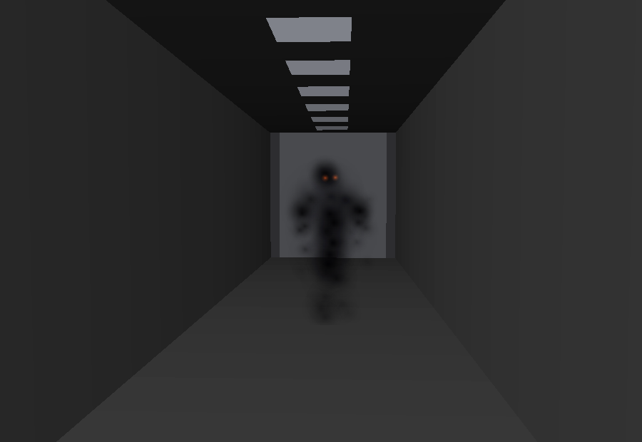

The daytime hauntings used to be a black capsule-and-sticks figure that floated. This is the
replacement, and the basis for the rest of the suite.

## The idea

Two traditions, deliberately mixed.

**Jinn.** In Islamic belief the jinn are made of smokeless fire - not the ghost of a dead person
but a creature of another order, living alongside you in the same rooms, with its own will. So
the apparition is *smoke*, and somewhere inside it there is fire: two embers where a face would
be. They are the only bright thing about it, and they are not eyes so much as coals.

**Vulto.** The Brazilian shadow person: a flat, man-shaped darkness standing in a doorway or at
the end of a hall, seen at the edge of vision, gone the instant you look straight at it. So the
smoke holds a human outline - shoulders, a head, the suggestion of a hood - it has **no feet**,
it does not walk, it *slides*, and when you look at it, it does not fade: it **comes apart**.

What that gets you that a silhouette did not: it has no anatomy to get wrong, it reads at corridor
distance as a hole in the light, and the way it leaves is the scariest thing it does.

## The corridor apparition

47 soft camera-facing puffs, two embers.

- **Core** (41 puffs) - near black, `0.010, 0.009, 0.014`. Stacked, they make the middle of the
  figure darker than the unlit corridor behind it.
- **Haze** (6 puffs) - big, almost transparent, faintly violet. This is the part that matters:
  against an unlit bulkhead a pure black figure is *nothing at all*. The haze is what you catch
  out of the corner of your eye.
- **Embers** (2) - additive, flickering, and they dim before the smoke does when it leaves.

Every puff has an anchor on the figure, a drift orbit (so the mass boils and never holds a shape)
and a dissolve direction. One parameter, `form`, slides every puff from its anchor out along that
direction and fades it: `form` 1 is a figure, 0 is nothing.

| | |
|---|---|
| 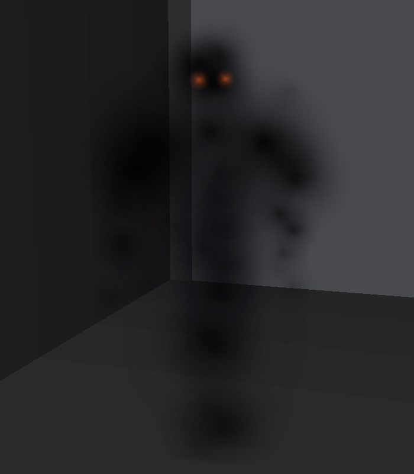 | 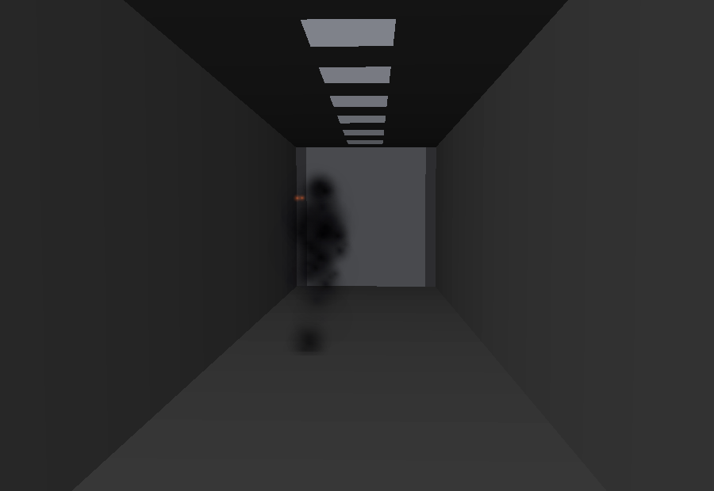 |
| Close, in the doorway light | Crossing: it leans into the slide and trails |

**Arriving** is `gather()` - the dissolve run backwards, so it condenses out of the corridor air.
**Leaving** is `disperse()`:

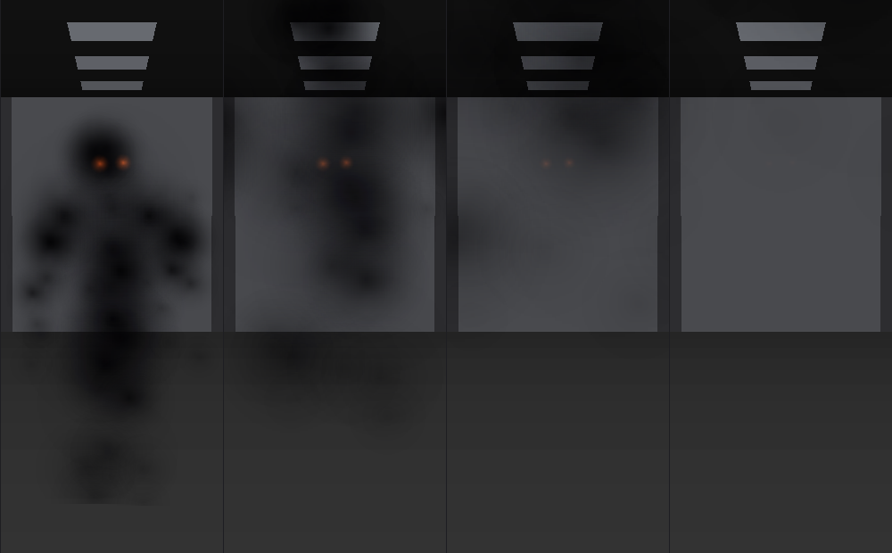

*Four frames of a stare: gathered, opening, the embers going out, gone.*

It is used two ways today, both through `ShadowFigure`: sliding across the mouth of a corridor
(agitated, leaning, trailing) and standing at the far end waiting to be noticed - the watcher,
which disperses once you have looked at it for 0.7 s or got within 3.5 m.

## The ghul

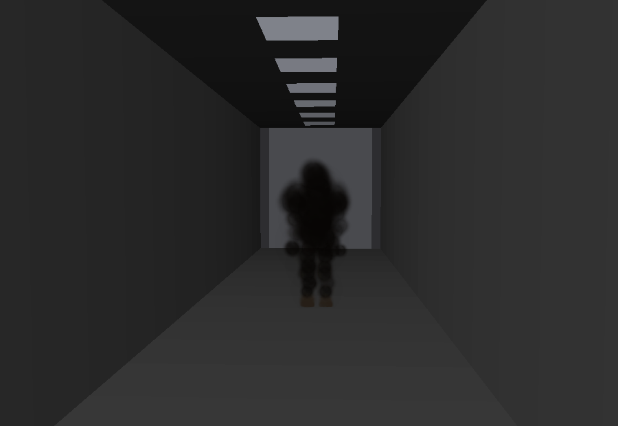

*What is standing at the end of the corridor. A crew member, facing away. Nothing about it is
lit - a shape against the light at the far end is all you ever really see down a corridor.*

The ghul of pre-Islamic Arabia is not a ghost either. It is a desert demon that waits off the road
in desolate country, takes the shape of a person to bring a traveller in off their route, and eats
what it catches. It lives on the dead. And in every
version of the story, whatever else it can change, **it cannot change its hooves**.

That is the whole design. This one does not jump out at you; it stands a long way off, looking
like a person, and waits for you to walk to it. While you are walking to it you are not doing your
shift. It is the only apparition in the suite that costs you something.

### Two layouts in one figure

Every puff carries a second anchor, and `morph` slides the whole figure between them.

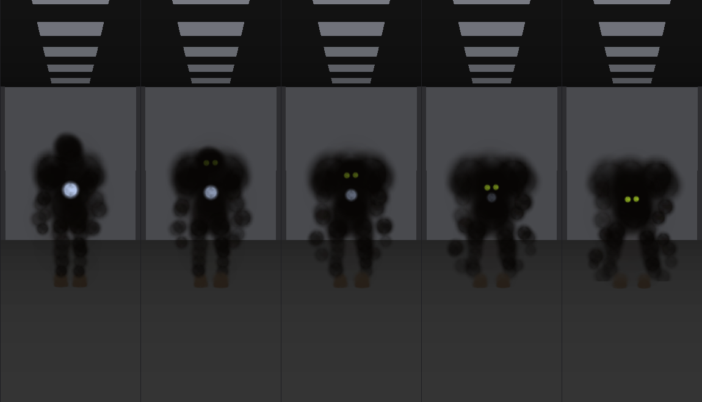

*Five frames of it deciding to stop pretending. Two eyes open - the first light it has shown -
the shoulders rise into a hunch above the head, the neck runs forward, the arms lengthen until the
hands are on the deck. The feet never move.*

| | |
|---|---|
| 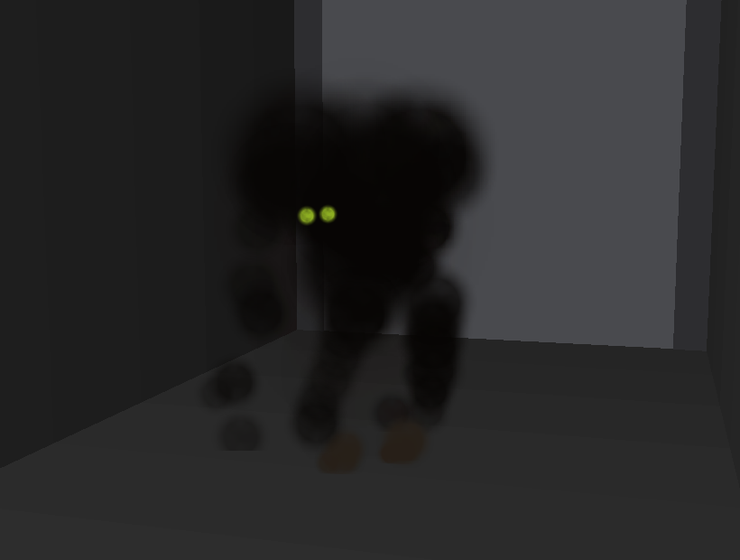 | 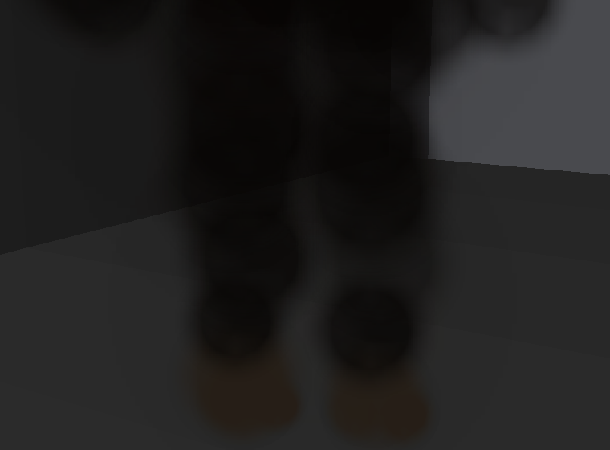 |
| Settled over its meal | The tell, there from the first frame |

**The hooves are in both layouts, in the same place, at the same size** - the one thing about it
that never changes. They are also the only part of the figure that is not smoke: they use a third
tint, horn-coloured, so they take the light when nothing else about it does. Two hard little
objects where a pair of boots should be, and a split at the toe. Nobody is meant to notice them
until they do.

The rest of it is tuned to pass, not to haunt: a higher `plateau` on the sprite (0.55 against the
vulto's 0) so the puffs merge into something solid instead of reading as smoke, browner and
heavier core colour - carrion rather than the vulto's cold black - fewer loose wisps, and legs,
which the vulto never has.

### The event

`scripts/ghoul.gd`. It appears from intensity 3 onward, at a spot at least 9 m away that you are
roughly facing, and stands there. It stops pretending when you get within 6.5 m **or** have looked
straight at it for 2.6 s - whichever you do first - takes 1.1 s to turn, holds the true shape for
a couple of seconds while you decide what to do about it, and then takes itself away down the
corridor and disperses.

It never touches you. The day is not when this station kills you.

## The Good Neighbours

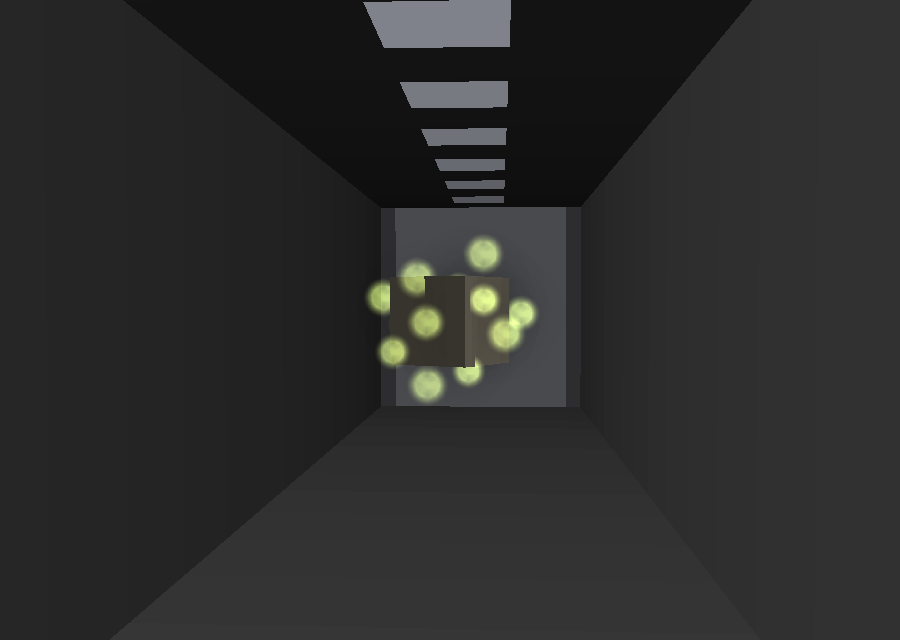

*Thirteen cold lights with a crate inside them, going somewhere with it.*

Not the Victorian fairy with wings on a flower - the older kind, the ones nobody would name out
loud. You called them the Good Neighbours, or Themselves, or the Fair Folk, because a name is a
way of getting someone's attention.

What they were actually blamed for, before anyone drew them, was small and constant and
infuriating: **things moved**. Tools not where you left them. Something thrown across a barn with
nobody in it. Lights in the yard at night, and in the morning the gate is off its hinges and
lying out in the field.

So this one does not stand anywhere and it does not look at you. It takes hold of something loose
- one of the kit's crates, a helmet, a drum - wraps itself round it as a shell of thirteen cold
gold-green lights, carries it a few metres, unhurried and wandering, the way you carry something
you are not in a rush with. And then it throws it.

### Envelop, carry, throw

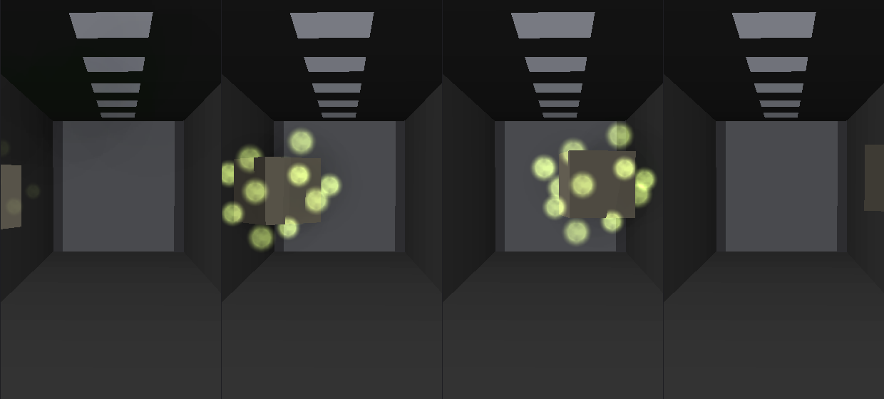

*It arrives, takes hold, carries the crate across the corridor, and lets go. The crate leaves at
about four metres a second. The lights go out half a second later.*

The station's loose props were always drifting on their own integrator; `Station` now lends one
out. `take_prop()` pulls it out of the drift so an apparition can move it, `release_prop()` hands
it back with a velocity, and `find_prop_near()` picks one close to wherever the event wants it.
Nothing else about the props changed - it is still the same crate you could have grabbed.

The throw is always aimed **across** your view rather than down it, and never back at the face of
whoever is watching.

### The half you never see

`seen` is decided per event, and it is false more often than not: **the lights only show up about
45% of the time.** The rest of the time the swarm is there, doing exactly the same thing, at zero
opacity.

What you get then is the real one. A crate comes out of a side passage at head height doing four
metres a second, crosses in front of you, hits the far wall - and there is nothing there, and
there was never anything there.

### Up close

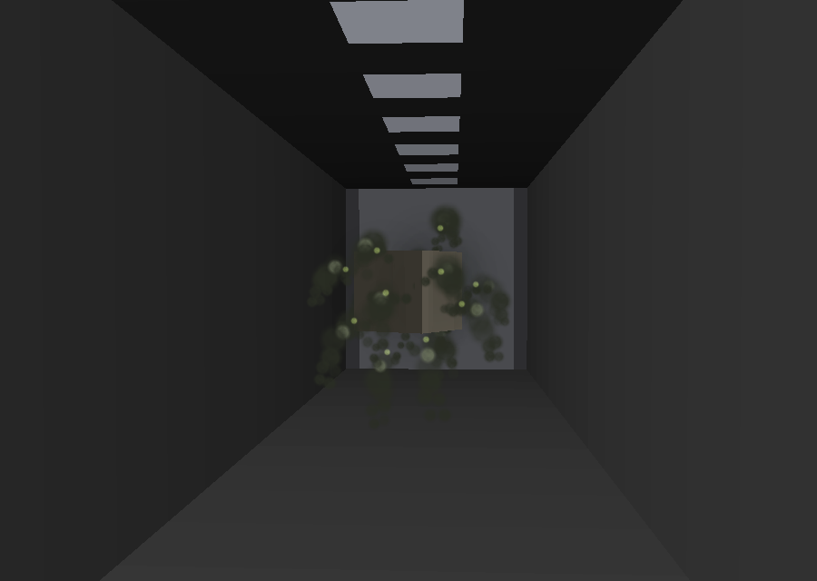

Inside 3.4 m the glamour comes off, the way it does with all of these. Each light collapses to a
pinprick and what was holding the crate is still holding it: a small long-armed body hanging off
the side of it, arms reaching in, pale face turned out at you. They are lit by their own wisps,
which is the only reason you can see them at all.

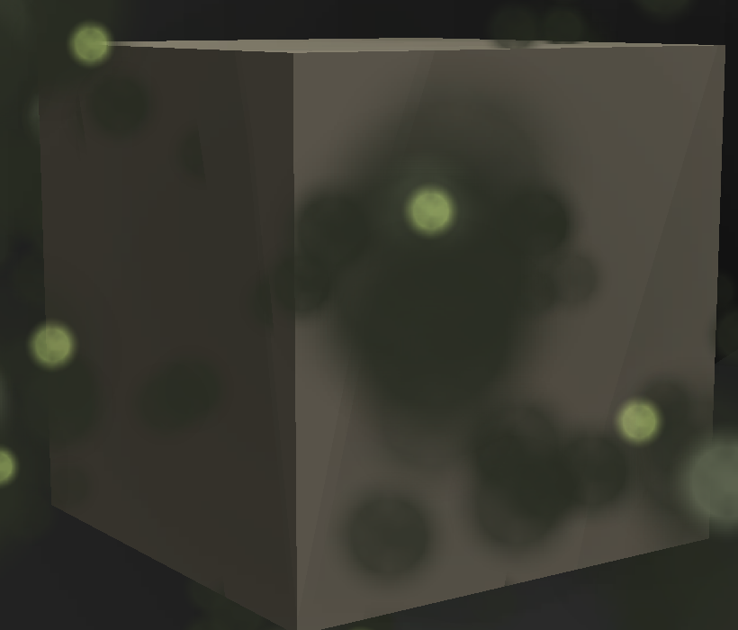

## The ritual

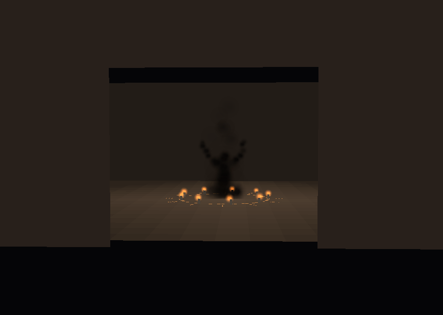

*Night. Main power has been dead for hours. One doorway is warm.*

This one is not from anywhere in particular - it is the oldest shape in the genre and it belongs to
everybody. A circle marked on the ground, lights round the edge of it, and a person sitting in the
middle with their hands up, working.

It appears **only at night, and only from day 6**, once, in a room you are not waking up in and
the stalker is not starting in. Six nights of the station behaving like a haunted machine, and
then on the second to last one there is somebody in a room doing this, and has been for a while. Nothing announces it. Either at some point tonight you see warm light coming out of a
doorway on a deck where nothing has been warm since the power failed, or you do not.

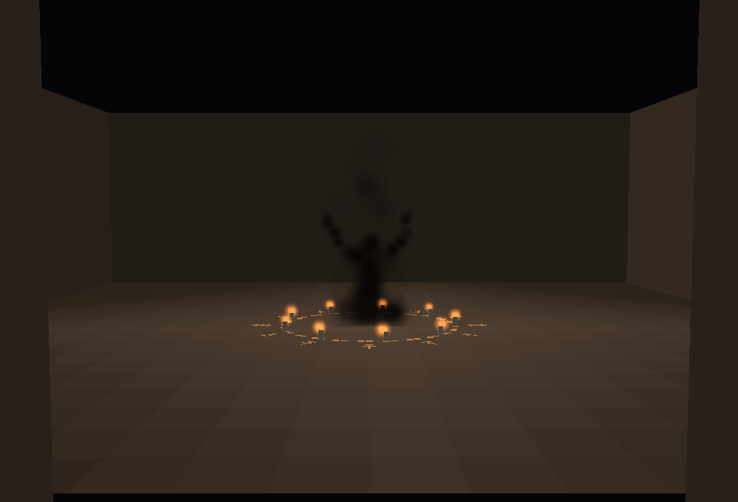

Nine candles on the circle, twelve glyphs round its rim, and somebody seated inside it: legs
folded, back straight, head bowed, both arms up and out. The figure is the same smoke as the rest
of the suite, but lit from below by its own candles rather than being a hole in the dark - warmer,
and slightly more solid than the vulto, holding a real human posture.

It never looks up. **It is the only apparition here that never once acknowledges that you exist.**

### What happens when you go in

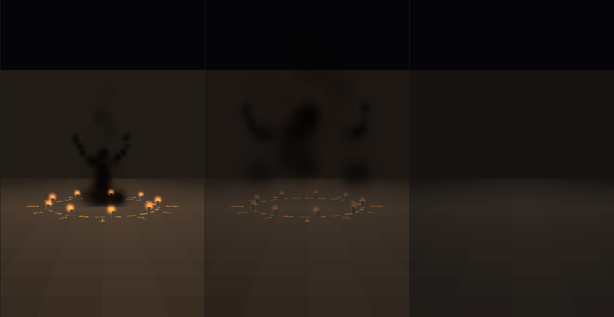

Nothing gutters and nothing flees. At 3.4 m it all **stops** - candles, glyphs, light, and whoever
was sitting there - in about a fifth of a second, and the room is a dark room with nothing in it.
No wax, no marks, no smoke afterwards, and nothing to interact with. If you leave and come back it
is not there either; there is one a night.

### How it is put together

The figure and the flames are a normal apparition rig (`kit/apparition_ritual.json`, 35 puffs and
9 embers keyed `flame`), so `form` takes the whole thing out at once. Everything else is real
geometry, because these are marks on a surface rather than smoke: `scripts/ritual.gd` builds the
scored ring, the twelve glyphs and the nine wax stubs with `Geo`, and hangs one warm `OmniLight3D`
in the middle of it on two flicker rates so it never settles into a pulse. That light is the part
that reaches down the corridor and gets you to walk over.

It is laid in the **room's own frame** - `Station.room_transform()` - so when the deck generator
has rolled that room ninety degrees, the circle is on what is now the wall, with somebody sitting
on it. In a station with no gravity that is not a bug in the ritual.

## The lights, and not being able to tell

There are two reasons a lamp on this deck stutters. One is that it is an old fitting on a station
nobody has maintained since the crew stopped filing reports. The other is that something is
standing under it. The entire design of this bit is that **you cannot tell which**, and four
separate things are doing that work:

**One routine, one vocabulary.** Both causes go through `_stutter()` and draw their character from
the same pool - `BLINK` (one or two frames of nothing, and half the time you are not sure it
happened), `STAMMER` (the classic five-to-ten), `DYING` (a ballast sinking, hanging there dim for
up to a second, then coming back like nothing happened) and `BANK` (it takes its neighbour with
it, which is either a shared circuit or worse). Volume and pitch are randomised per stutter, not
per cause. There is no signature to learn, because the moment the haunted ones have one the player
stops doubting and starts reading.

**Most flickers are nothing.** Three or four lamps per deck are genuinely failing -
`Station.faulty_lights`, picked with the deck seed, so this run's bad lights stay this run's bad
lights and the player can learn where they are. They stutter on their own timer all day, getting
more frequent as the station degrades. That background is most of the flickering in a run, and it
is what makes every other flicker deniable.

**The ambient ones happen where apparitions happen.** When the haunt manager fires a flicker event
it picks a genuinely faulty lamp two thirds of the time and, the rest of the time, the lamp nearest
a spot an apparition *would* have used. So "it flickered at the junction ahead" carries nothing
either.

**And things stand under the lamps you already know are bad.** A third of the time an apparition
takes whichever of its candidate spots is nearest a failing light. The lamp you have learned not
to trust is also the one with something under it - which is the point at which the two explanations
stop being separable at all.

On top of that, each daytime apparition rolls `APPARITION_FLICKER` (20%) when it spawns, and half
of those hits are **delayed 0.6-1.6 s**, so the light goes once the thing is already standing
there rather than announcing it. Night is exempt: main power is dead and the dark down there does
not need help.

### And then the sound

Every stutter, whatever caused it, gets the same two layers: the switching noise, and **`ballast`**
- what a failing fitting actually sounds like, 120 Hz mains buzz gated into irregular bursts with
the odd contact tick, pitched and levelled at random per stutter.

Under about **three in five** of the haunted ones there is a third layer. **`underbreath`** is
something breathing, close, pitched down to a throat and rolled off at 900 Hz, mixed at **-26 dB
with a seven metre falloff** and started a beat *into* the buzz rather than alongside it. It is
built so that it does not arrive as a sound. It arrives as a suspicion that the buzz had something
in it - and only if you happen to be near that lamp, and quiet, and listening.

It also plays under about **one in seven** of the lamps that are genuinely broken.

That last number is the whole trick. A tell with no false positives is not a tell, it is a label:
the player hears it twice, learns it, and never doubts anything again. At one in seven the signal
is real - if you hear it, something is more likely to be there than not - but it can never be
trusted, and the players who learn to listen for it will spend the back half of the run standing
still in corridors, in the dark, next to a lamp they know is just old, deciding whether they heard
breathing. That is the game.

Both sounds are synthesised by `tools/gen_flicker_audio.py`, in pure Python with no dependencies,
because the two files the whole mechanic hangs on should be rebuildable anywhere.

## Cost

Two draw calls per apparition however many puffs it has - the swarm's 192 included: one `MultiMesh`
of billboarded quads for the smoke, one for the embers, with per-instance colour carrying the
alpha. The sprite texture is generated once from
a hash-based value noise and shared. No particle system, no shader.

## The files

| | |
|---|---|
| `tools/apparition_spec.py` | every figure in the suite: puff layouts, embers, the smoke formula. **Edit this.** |
| `tools/build_apparition.py` | writes `kit/apparition_*.json` and the images here |
| `tools/render_apparition.py` | the reference renders |
| `kit/apparition_corridor.json` | the vulto: 47 puffs, 2 embers |
| `kit/apparition_ghoul.json` | the ghul: 62 puffs (8 of them hooves), 2 embers, all of it morphing |
| `kit/apparition_fae.json` | the swarm: 192 puffs, 13 wisps, 13 little bodies hanging off them |
| `kit/apparition_ritual.json` | the seated figure: 35 puffs, 9 candle flames |
| `scripts/apparition.gd` | builds and animates any of them - one class, one JSON per figure |
| `scripts/shadow_figure.gd` | the two vulto events (crossing, watching) |
| `scripts/ghoul.gd` | the lure |
| `scripts/fae.gd` | the swarm: takes a prop, carries it, throws it |
| `scripts/ritual.gd` | the circle, the candles, the light, and the stop |

    python3 tools/build_apparition.py

The smoke sprite is the same formula in both languages, on the same integer hash, so the images
match what the game draws rather than illustrating it.

## The rest of the suite

The parts that generalise are the puff cloud, `form`, `morph`, and the gather/disperse pair. A new
apparition is a new layout function in `tools/apparition_spec.py` plus its own JSON - `Apparition`
itself does not care which figure it is building. Candidates, none built yet:

- **The one in the vent** - smoke pouring *out* of a wall grille and pooling along the ceiling,
  no figure at all until it has finished pouring.
- **The one in the machine** - a jinn inhabiting a console: embers behind the screen, smoke
  bleeding from the seams, the terminal working normally the whole time.
- **The one behind you** - gathers only in the space you are not looking at, and is never there
  when you turn; the only evidence is the ember light on the wall in front of you.
- **The crowd** - several vultos at the far end of a long corridor, standing in a line, all of
  them dispersing at once when the lights come back.

Four built: the vulto, the ghul, the Good Neighbours, and the ritual.
