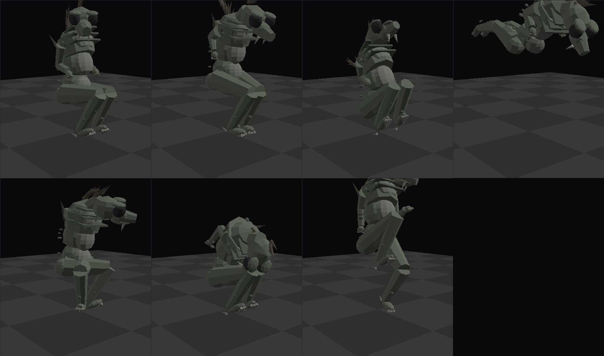
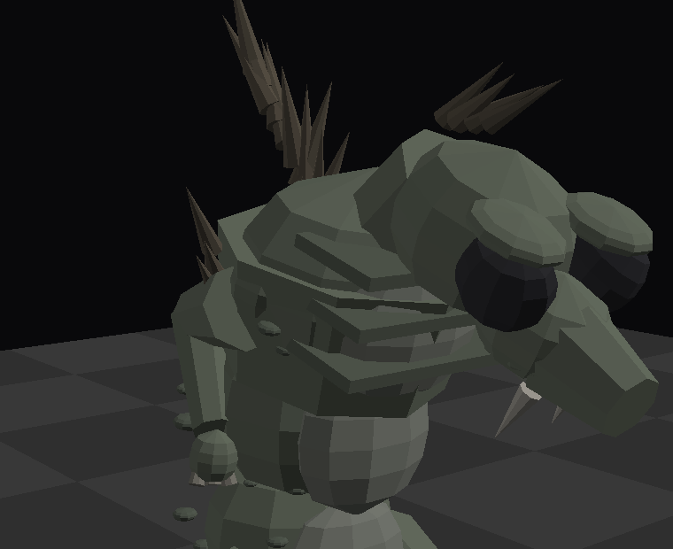
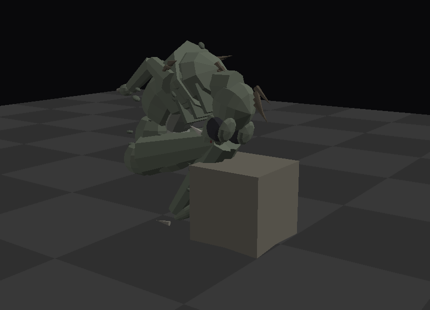
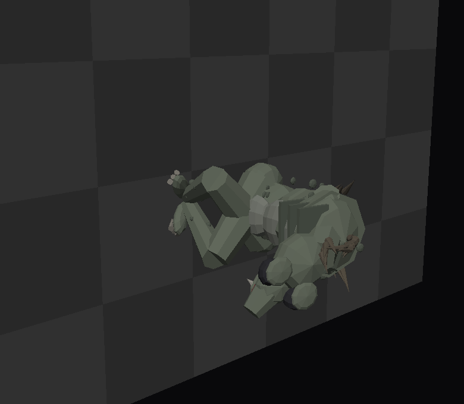

# The chupacabra

*Reading order: perch, alert, coil, leap, cling, feed, scuttle.*

Deliberately the **1995 Puerto Rican** one - the Canóvanas sightings, the description Madelyne
Tolentino gave that every witness after her repeated - and not the mangy Texas coyote the name got
attached to a decade later.

That means: bipedal, waist height on a grown adult, grey-green and leathery, **enormous black oval
eyes** with nothing in them, a row of spines down the back that *move*, small clawed forelimbs
held up against the chest, huge hind legs, and **no tail**. It does not run. It hops, and the hops
are far too long for the size of it.

*Crest up. The eyes wrap round the sides of the skull; the two fangs are the only teeth worth the
name, because they are the only two it needs.*

## What it is actually famous for

Not the encounter - the **evidence**. Stock found in the morning, not torn up and not eaten:
drained, through two neat punctures, with nothing spilled.

On Kestrel-9 the things that hold pressure are the loose canisters, the coolant drums and the
power cells that are already drifting around the deck, so that is what it feeds on. You find it
crouched over one with its head down.

It does not look up while it does this, which is the only reason anyone has ever got close to one.

## Clinging, and then not being there

In a station with no floor, a hopper is worse than a walker. It has no opinion about which surface
it is on - the `cling` pose is splayed flat with all four sets of claws in and the head turned out
of the plane - and when it goes, it kicks off and crosses the corridor in one go.

`scripts/chupacabra.gd` runs the whole thing as four states:

| | |
|---|---|
| **feed** | head down on a prop, ignoring you, for up to 26 s |
| **alert** | you got within 5 m or stared for 1.4 s: head up, **every spine standing**, staring back for 0.7 s |
| **coil** | 0.22 s, wound onto itself with the load on |
| **leap** | 7.5 m/s away from you, never through you, gone in under two seconds |

It drops what it was drinking when it goes - `Station.release_prop()` - and leaves the husk
tumbling in the corridor, which is the whole story about this animal.

## The files

| | |
|---|---|
| `tools/chupacabra_spec.py` | the rig: materials, bones, parts, poses. **Edit this.** |
| `tools/riglib.py` | the shared rig machinery: bones, parts, spines, mottling, poses, floor solver |
| `tools/build_creature.py` | writes `kit/chupacabra_rig.json` (and the stalker's) plus the sheets |
| `tools/render_creature.py` | `--rig chupacabra --pose leap`, and `--eye/--target/--fov` |
| `kit/chupacabra_rig.json` | 24 bones, 134 parts, 7 poses (49 kB) |
| `scripts/creature.gd` | builds either rig - one class, one JSON per creature |
| `scripts/chupacabra.gd` | the event |

    python3 tools/build_creature.py --rig chupacabra

About 134 parts against the stalker's 4,194: this one has no fur, and that is most of the
difference. Same merging - one mesh per bone, a surface per material - so it is 24 nodes.

The night stalker's rig (`tools/creature_spec.py`, `docs/CREATURE.md`) predates `riglib` and still
carries its own copy of those helpers. Anything new should be built on `Rig`.
