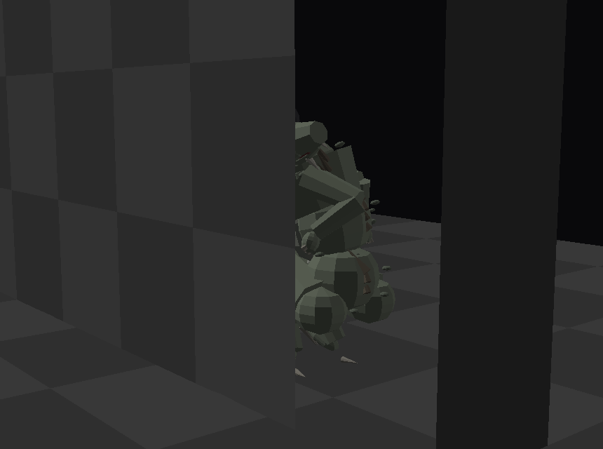
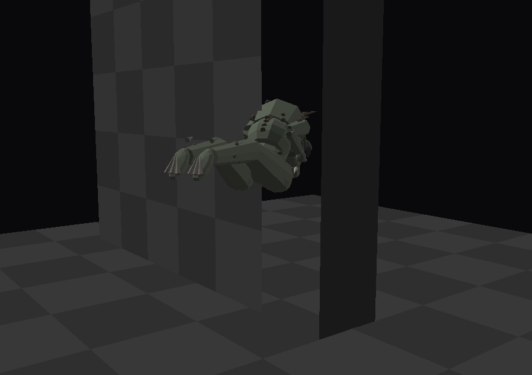

# The chupacabra

*Reading order: peek, withdraw, alert, coil, leap, cling, perch, feed, scuttle.*

Deliberately the **1995 Puerto Rican** one - the Canóvanas sightings, the description Madelyne
Tolentino gave that every witness after her repeated - and not the mangy Texas coyote the name got
attached to a decade later.

That means: bipedal, waist height on a grown adult, grey-green and leathery, **enormous black oval
eyes** with nothing in them, a row of spines down the back that *move*, small clawed forelimbs
held up against the chest, huge hind legs, and **no tail**. It does not run. It hops, and the hops
are far too long for the size of it.

*Crest up. The eyes wrap round the sides of the skull; the two fangs are the only teeth worth the
name, because they are the only two it needs.*

## What the encounter actually is

*The wall has most of it. What is out in the corridor with you is a head craned back over a
shoulder, and the eyes.*

Almost every time, this is the whole thing. It is not a creature crossing your path - it is a
**corner with something at the bottom of it**. The body is round the edge, turned away down the
side passage, low and pressed to the wall, and it stays there. Only the head comes round.

You look at it. It looks at you. And then it is not there, and the corner is a corner.

`peek` is built for exactly that: the body angled away, the crane split between the neck and the
head the way an animal does it, the crest flat - it does not want to be a shape yet - and one hand
up on the edge it is looking round.

## Then it is gone

Being noticed is the trigger: within 4.5 m, or **0.35 s of your eyes actually on it**. Three times
out of four it simply withdraws - crest coming up on the way out, head coming back round to where
the body already is, and half a second of sliding deeper into the passage. You get about as long
to be sure of what you saw as you would in real life, which is not long enough.

The fourth time it goes the loud way: 0.18 s coiled, then off the wall at **7 m/s across the mouth
of the passage**, through your view and out of it. In a station with no floor a hopper does not
need a run-up, and it does not need the ground to land on either.

If you never notice it at all, it leaves anyway after 22 seconds. It never comes toward you. The
day is not when this station kills you.

| | |
|---|---|
| **lurking** | holding `peek`, up to 22 s |
| **withdraw** (75%) | 2.6 m/s deeper into the passage for 0.55 s, then nothing |
| **coil → leap** (25%) | 0.18 s wound up, then 7 m/s across the opening for 0.9 s |

`Station.corner_spots()` supplies the places: a point tucked 1.15 m into a side passage and 0.95 m
off its axis, so the corner wall takes most of it. The event only picks one that is **off to one
side of where you are looking** - between 20° and 70° off your heading - because the encounter is
noticing something at the edge of a corridor you were walking past anyway, not finding it dead
ahead.

## Drinking

The folklore's famous part is the evidence: stock found in the morning, not torn up and not eaten
- drained, through two neat punctures, with nothing spilled. On Kestrel-9 the things that hold
pressure are the loose canisters, drums and power cells already drifting around the deck, and the
`feed` pose is built for it: head down, both hands on the thing, spines flat, and it does not look
up while it does this.

Nothing spawns it at the moment - the corner is the encounter, and two different chupacabra events
would dilute both. The pose is in the rig, and `Station.take_prop()` / `release_prop()` are already
there from the Good Neighbours, so it is a short walk to switching it on.

## The files

| | |
|---|---|
| `tools/chupacabra_spec.py` | the rig: materials, bones, parts, poses. **Edit this.** |
| `tools/riglib.py` | the shared rig machinery: bones, parts, spines, mottling, poses, floor solver |
| `tools/build_creature.py` | writes `kit/chupacabra_rig.json` (and the stalker's) plus the sheets |
| `tools/render_creature.py` | `--rig chupacabra --pose leap`, and `--eye/--target/--fov` |
| `kit/chupacabra_rig.json` | 24 bones, 134 parts, 9 poses (56 kB) |
| `scripts/creature.gd` | builds either rig - one class, one JSON per creature |
| `scripts/chupacabra.gd` | the event |

    python3 tools/build_creature.py --rig chupacabra

About 134 parts against the stalker's 4,194: this one has no fur, and that is most of the
difference. Same merging - one mesh per bone, a surface per material - so it is 24 nodes.

The night stalker's rig (`tools/creature_spec.py`, `docs/CREATURE.md`) predates `riglib` and still
carries its own copy of those helpers. Anything new should be built on `Rig`.
