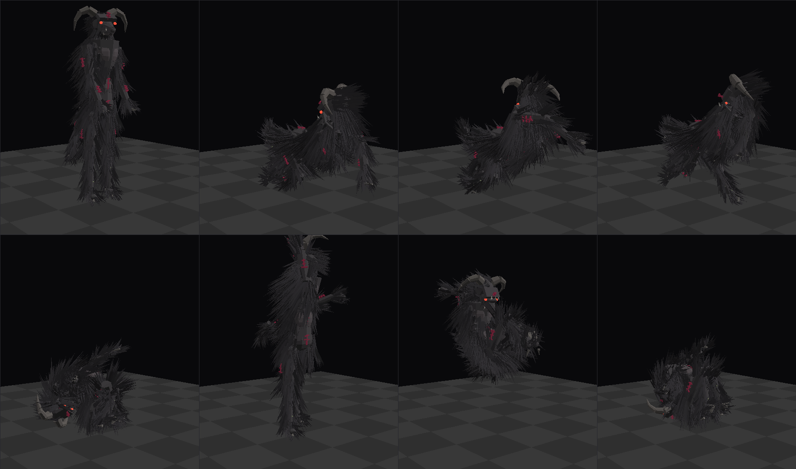

# The night stalker

*Reading order: upright, crawl A, crawl B, dislocate, contort, freeze, lunge, coil.*

The thing that walks Kestrel-9 after dark. It replaced a capsule-and-sticks silhouette, and the
daytime apparitions now use the same body, so what crosses a doorway at the far end of a corridor
is recognisably what is coming for you at night.

## What it is

A humanoid frame gone wrong under a heavy pelt. Roughly 1.95 m standing; 4,194 parts and about
31,000 triangles, of which the coat is 4,040 strands.

- **Head** — a human skull's proportions with a soft, lizard-like snout laid over it: long
  muzzle, pale underside, a nose pad, teeth top and bottom, a heavy brow with the eyes set under
  it. Horns come off the temples and sweep back and **down** past the jaw in four tapering
  segments, hugging the skull like a ram's.
- **Hide** — near black (albedo 0.05) and fully rough. This is deliberate: in an unlit corridor
  it is a hole in the dark, and it only resolves when your flashlight lands on it.
- **Coat** — 4,040 strands of shaggy fur over everything but the face, the hands' claws and the
  horns: a mane over the shoulders, a ruff round the neck, long hair hanging off the arms, a
  skirt over the hips, the legs furred to the ankle and the feet hairy on top. Long guard hairs
  over a shorter undercoat, grown in clumps rather than scattered evenly, all of it lying the way
  a coat lies — down the body, down the limbs, back along the skull. It is the silhouette that
  does the work: the coat is what stops the shape reading as a man and makes it read as something
  big and shaggy in the half second your torch is on it.
- **Runes** — 46 painted strokes in dark wine, barely self-lit, on **shaved patches** (the fur is
  kept clear of every mark, because paint goes on skin), down the belly, across the chest,
  between the shoulder blades, over the brow, along both arms, both thighs and the tail. Paint,
  not neon: they carry a trace of emission so they hold a little colour in the dark, and read
  properly when the beam is on them.
- **Hands and feet** — four long claws instead of fingers, plus a thumb claw; three fore claws
  and a spur on each foot.
- **Spores** — 18 pale growths clustered up the shins, faintly luminous.
- **Tail** — six tapering, quilled segments ending in a hooked spike.

## How it moves

It does not animate so much as **snap**. Poses are held, then swapped between one frame and the
next, with a per-joint jitter running on top, so joints look like they dislocate and reseat as it
travels. `scripts/creature.gd`:

- **Walking** it goes belly up on all fours, head first. That combination is only geometrically
  possible if the body is *also* mirrored through 180° — its left hand plants on your right — and
  that mirror is what makes the walk read as wrong before you can say why. The spine arches back
  so the face leads, chin first. It alternates `crawl_a`/`crawl_b` at a stride interval that
  shortens as the nights get worse.
- **Mid-stride** it drops, at random, into a frame no body holds: `dislocate` (the right leg
  driven through its own stop, hip rolled out of the socket, still carrying weight) or `contort`
  (folded into a knot, head turned right round). Held for 0.08–0.22 s, then back to the stride.
- **Immobile** — frozen in your flashlight, or idle — it comes **upright**, because a thing that
  stands up when it stops is worse than one that keeps crawling. It holds still and twitches,
  occasionally snapping into `freeze`: mid-glitch, head cocked flat onto its side.
- **Lunge** is the jumpscare shape, held: off the ground, folded open, everything pointed at you.

Intensity drives it: `glitch` (how often the broken frames come) and `step_time` both scale with
the night counter, and the eyes only catch the light from night 2 onward.

## The files

| | |
|---|---|
| `tools/creature_spec.py` | the rig: materials, bones, parts, poses. **Edit this.** |
| `tools/build_creature.py` | writes `kit/creature_rig.json` and the images in `docs/` |
| `tools/render_creature.py` | the pose renders (`--pose crawl_a`, `--eye`, `--target`, `--fov`) |
| `tools/render3d.py` | a small z-buffered software renderer, no dependencies |
| `kit/creature_rig.json` | 29 bones, 4,194 parts, 8 poses - what the game loads (1.4 MB) |
| `scripts/creature.gd` | builds it in Godot, and drives the pose snapping |

    python3 tools/build_creature.py        # rebuild the rig and the reference sheet

Parts are merged per bone into one mesh with a surface per material, so the whole creature is 29
nodes rather than four thousand. The rig JSON, the merged meshes and the materials are all built
once and shared by every instance in the session - the daytime apparitions spawn constantly, and
merging four thousand strands per spawn would hitch. Fur uses a cheap `strand` primitive: a
three-sided tapered cylinder with no caps, six triangles each.

The coat is placed by `fur_blob` (over a rounded part, strands grown off an ellipsoid surface)
and `fur_limb` (wrapped round a limb segment). Both take a `sweep` - which way the coat lies -
and blend it against the surface normal, so raising `out` bristles the fur and lowering it lays
it flat. `BARE` keeps strands off the runes.

A pose is joint angles in degrees on top of the rest skeleton, plus a root height; a solver drops
each pose onto the floor at build time (`settle()`), so nothing hovers or sinks - except `lunge`,
which is supposed to be in the air.

The renders are a check tool, not a target: flat shading, one key light, no shadows. Real
materials and the flashlight will look considerably better - and considerably darker.
