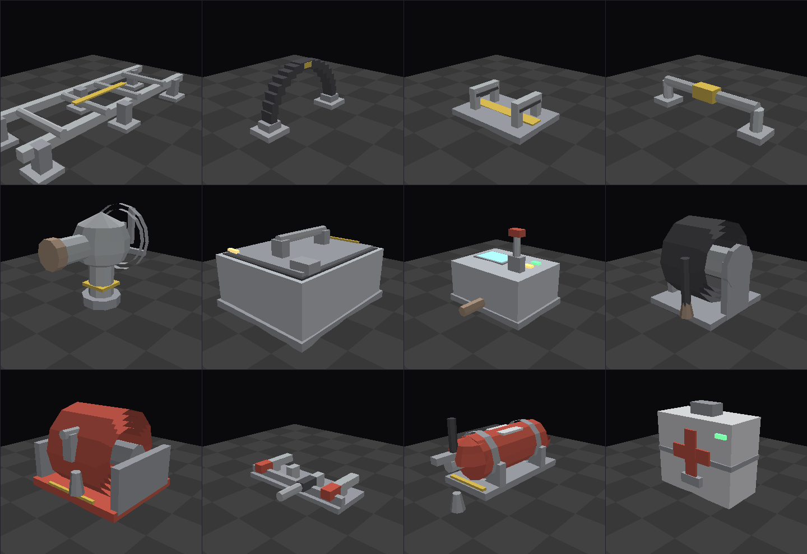
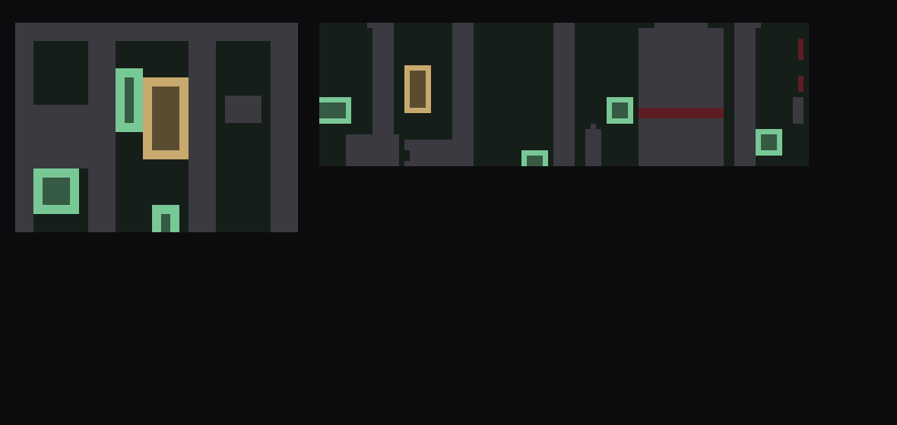

# Space Station Interior Kit

A modular, procedurally generated station interior in industrial "used future"
styling — nine corridor modules and eight fitted-out rooms — authored for Godot 4 and
supplied as glTF 2.0 plus a Blender rebuild script.

## Grid and dimensions

Every module occupies a **4.0 m × 4.0 m** footprint and is centred on the origin,
with the **floor surface at y = 0** and ceiling underside at y = 3.0 m. The interior
is 3.0 m wide; walls occupy the outer 0.5 m on each side. Pieces therefore snap
together on a 4 m grid with no offset fiddling — place them at multiples of 4 on X
and Z and the bulkhead frames line up.

Scale is 1 unit = 1 metre, matching Godot's default. Authored Y-up, so no rotation
correction is needed on import.

## The pieces

| File | Tris | Open sides | Notes |
|---|---|---|---|
| `corridor_straight.glb` | 1440 | −Z, +Z | |
| `corridor_door.glb` | 1632 | −Z, +Z | closed pressure door at centre |
| `corridor_corner.glb` | 1428 | −Z, +X | 90° turn |
| `corridor_tjunction.glb` | 1080 | −Z, +Z, +X | |
| `corridor_cross.glb` | 732 | all four | |
| `corridor_endcap.glb` | 1992 | −Z only | dead end with terminal console |
| `corridor_window.glb` | 1480 | −Z, +Z | viewport on the +X wall |
| `corridor_window_double.glb` | 1520 | −Z, +Z | viewports on both side walls |
| `corridor_observation.glb` | 1896 | −Z only | bay glazed on three sides |

Rotate corner, T-junction, end cap and the window pieces in 90° steps to face any
direction. The corridor set is roughly 13,200 triangles; with the eight rooms the whole
kit is about 54,000, so an entire deck costs very little.

## The rooms

Rooms are **12 × 12 m** — a 3 × 3 block of the same grid — so a room's centre still
lands on a cell centre and its doorway lines up exactly with the centre line of the
adjoining corridor cell. Interior is 11 × 11 m with the ceiling at **3.6 m**, taller
than the corridors; the doorway aperture stays 3.0 m so a corridor section butts
straight on with a header above it.

**Placement rule:** a room centred at (cx, cz) spans ±6 m, so the corridor cell that
connects to it sits **8 m** away on that axis. A room at (0, 0) meets a corridor cell
centred at (0, −8) through its −Z doorway. Each room has a single doorway on its −Z
wall; rotate in 90° steps to face it wherever you need.

| File | Tris | Contents |
|---|---|---|
| `room_control.glb` | 6096 | arc of five console bays with lit screens and chairs, main wall display, side equipment racks, gallery rail |
| `room_power.glb` | 4908 | three capacitor towers with glow bands and guard rails, breaker cabinets, cable trunking, overhead bus runs |
| `room_plant.glb` | 5288 | two pressure vessels on saddles, pump sets, valved pipe manifold, air-handling unit with fan and ceiling duct |
| `room_laboratory.glb` | 4656 | benches with under-counter cabinets, fume hood with glass sash, sealed glovebox, sample shelving, emergency shower |
| `room_observation.glb` | 3496 | glazed on three sides, tiered seating facing the main viewport, tables and chairs, planters |
| `room_exercise.glb` | 3580 | two treadmills with lit consoles, resistance machine with weight stack, exercise bike, mat area, free weights, lockers, mirror |
| `room_server.glb` | 8252 | two rack rows flanking a cold aisle, LED-lit rack fronts, overhead cable trays, cooling unit, operator station |
| `room_eva.glb` | 4652 | circular airlock hatch with locking wheel, six suit alcoves with suits, tool bench, charging docks, hoist rail, floor hazard marking |

Every room keeps the area in front of its doorway clear, so nothing blocks you walking
in from the corridor, and circulation rails are split rather than run wall to wall.

## The loose props

`kit/prop_*.glb` — the small objects that drift through the deck: the things you bump into,
grab to pull yourself along, and that get shoved around when the haunting escalates. Each one
is centred on X/Z with its base at **y = 0**, fits inside a 1 m box (so it clears a 3 m corridor
at any tumble angle) and reuses the same material names as the modules, so a palette remap
applied to the kit covers the props too.

Every prop is filed under one of three **classes**, which is what decides how the game places it:

- **wall** — bolted flush to a wall surface, upright on its mount. It does not tumble and the
  haunting cannot shove it. Because the deck's cells are rolled about their axis, "wall" means
  whichever surface the cell's roll has turned into one.

  **Every wall fitting is a handhold.** In a station with no floor a bare wall is a wall you
  cannot cross, so these are the furniture and the route at the same time - and the collider is
  the piece's box plus a 6 cm margin (`Station.GRAB_MARGIN`), so a hand that comes near a rail or
  a strap catches it instead of passing through the gap in the middle. They sit on collision layer
  1, the same layer as the hull, so grabbing a fitting and grabbing the wall behind it feel
  identical.

  They are also placed where there is genuinely room for them - see **Finding the bare wall** below.
- **floating** — loose in the corridors: tumbling, drifting, shoveable.
- **equipment** — floating too, but kept in the work area of the room type it belongs to, and kept
  above about 1.6 m: benches, racks, capacitor towers and seating all live under that, and a
  canister drifting through a console reads worse than no canister at all.

| File | Tris | Class | Room | Notes |
|---|---|---|---|---|
| `prop_ladder.glb` | 308 | wall | corridors, EVA airlock | rail run with four rungs |
| `prop_grab_loop.glb` | 216 | wall | corridors, all rooms | webbing loop off two anchor plates |
| `prop_foot_restraint.glb` | 120 | wall | corridors, gym | two angled loops to hook your boots under |
| `prop_handhold.glb` | 132 | wall | corridors, all rooms | plain grab bar |
| `prop_valve.glb` | 436 | wall | power, life support, lab, EVA | pipe elbow and a wheel - nothing grabs better |
| `prop_locker.glb` | 140 | wall | all rooms | shallow locker with a bar handle across it |
| `prop_control_box.glb` | 152 | wall | corridors, all rooms | junction box, lever, lamps, a little screen |
| `prop_cable_reel.glb` | 256 | wall | corridors, life support, server | hose coiled on a drum, nozzle hanging off it |
| `prop_hose_reel.glb` | 272 | wall | power, life support, lab, server | fire hose, with a grab bar across the recess |
| `prop_tool_rack.glb` | 176 | wall | power, control, server, EVA | clipped tools, one of them missing |
| `prop_extinguisher.glb` | 328 | wall | corridors, all rooms | bottle in bracket straps, lying along the wall |
| `prop_medkit.glb` | 108 | wall | corridors, all rooms | first aid pack, red cross panel, status light |
| `prop_crate.glb` | 240 | floating | corridors | ribbed supply crate, corner cage, hazard edge |
| `prop_crate_large.glb` | 240 | floating | corridors | pallet-sized box with a lid seam and catches |
| `prop_debris.glb` | 120 | floating | corridors | torn-off hull panel, bent ribs, cut cable |
| `prop_ration.glb` | 60 | floating | corridors | sealed food pouch |
| `prop_canister.glb` | 500 | equipment | life support, laboratory, EVA airlock | pressure cylinder, valve under a collar cage |
| `prop_drum.glb` | 260 | equipment | life support | fluid drum with rolling hoops and bung caps |
| `prop_toolbox.glb` | 96 | equipment | control room, power plant, gym | hinged case, carry handle, charge LED |
| `prop_power_cell.glb` | 156 | equipment | power plant, server room | finned battery pack with charge LEDs |
| `prop_helmet.glb` | 532 | equipment | EVA airlock, observation deck | EVA helmet, tinted visor, neck ring, lamp |
| `prop_slate.glb` | 72 | equipment | control, laboratory, observation, gym, server | crew tablet with a lit screen |

About 4,900 triangles for the set. `scripts/station.gd` holds that classification in
`PROP_CLASS`, with `WALL_CORRIDOR`, `WALL_ROOM`, `WALL_BY_ROOM`, `FLOATING` and `EQUIPMENT`
saying where each class is drawn from. Two thirds of straight corridor cells get a fitting and a
third of those get one on each side; rooms get two or three on each side wall plus a couple on the
back wall, half of them drawn from what that room is actually for - valves where there is
something to shut off, tool racks where something is maintained, hoses where something can burn.

### Finding the bare wall

*Left: a corridor cell's side wall. Right: a wall of the power plant. Dark = bare wall a fitting
can bolt to; grey = something already standing there; red = a surface nothing gets bolted over
whatever its depth. The outlines are where fittings actually landed - amber ones are mounted
upright.*

A fitting is never dropped at a random point and hoped for. `Kit.wall_profile()` builds a flat
profile of each mounting plane - a 10 cm grid across the wall holding how far the geometry there
stands proud of it - and `Kit.find_clear_spot()` searches that grid for every position where the
fitting's whole footprint is bare, then picks one. Four things fall out of doing it that way:

- **Nothing clips.** Ribs, pipe runs, cable trays, window frames, door surrounds, consoles, racks
  and capacitor towers are all in the profile, and a fitting that would sit on any of them is not
  placed there.
- **Lamps, screens, glazing and doors are off limits** whatever their depth - the kit sets its
  light strips flush into the wall, so depth alone would happily hang a locker on one.
- **The wall's own panelling is not an obstacle.** Corridor pieces panel their walls 6 cm proud of
  the nominal plane and rooms 10 cm, so each plane carries that figure (`CORRIDOR_FACE`,
  `ROOM_FACE`) and a fitting's backplate sits on the finished surface rather than 6 cm inside it.
- **Fittings do not land on each other.** Every wall keeps a running tally of the cells its
  fittings have used, and the search treats those as occupied too.

Some fittings mount **upright** (`Station.UPRIGHT`): the bare panels between a corridor's ribs are
about 0.6 m wide and 2 m tall, so a ladder laid sideways fits nowhere and a ladder stood on its
end fits almost everywhere - which is also how anyone would actually bolt one on.

If a wall has no room for a fitting, it does not get one. A fitting that is not there is invisible;
a fitting through a pipe is the first thing anyone sees, and it makes the whole deck look
generated.

`tools/render_wall_map.py` draws the picture above from the same data, so the rule can be checked
against the real kit without opening Godot. Every prop gets a box collider either way, so a prop is also something you can grab and
pull yourself along by — which is the whole point of the wall attachments.

They are built by `tools/build_props.py`, which is self-contained — pure Python, no Blender and no
third-party modules:

    python3 tools/build_props.py --check   # rewrites kit/prop_*.glb and re-parses each one

`tools/proplib.py` holds the glTF writer, the material palette and the primitives (box, cylinder,
sphere, corner frame). Adding a prop is a function plus one line in `PROPS`; the builder checks
every piece rests on y = 0 and stays under a metre before it writes anything.

## The window pieces

Each viewport is a genuine aperture cut through the hull — the slab is laid as four
pieces around the opening rather than punched out of one, since the generator is
additive and has no boolean operations. Each one carries a recessed reveal, a
perimeter gasket, mullions dividing the panes, an inner frame with bolt heads, a
blast-shutter housing with guide rails above, a hazard line under the sill and a
handrail across the glazing.

`corridor_window` glazes the +X wall only, so a run of them puts windows down one side
of a corridor; rotate 180° to face the other way. `corridor_window_double` glazes both
side walls. `corridor_observation` is a dead-end bay glazed on three sides with a
taller, wider aperture on the end wall (2.6 m × 1.72 m, single central mullion) — that
is the piece to point at a planet.

**The view is yours to supply.** The glazing is transparent geometry; what you see
through it is whatever your Godot `WorldEnvironment` sky shows. If you want Earth out
there, that is a panorama sky texture or a large textured sphere in your scene, not
part of this kit. The planet in the preview images is scenery generated by the preview
renderer purely so the apertures could be checked against something — it is deliberately
not exported.

Glazing uses the `Glass_Window` material with `alphaMode: BLEND` and base colour alpha
0.14, double-sided. Godot imports this as a transparent material. Two things worth
knowing: transparent surfaces do not write depth, so if you stack several window
modules in a line you may see sorting artefacts through them — setting the material's
Transparency to *Alpha Pre-Pass* (or Depth Draw Opaque) in Godot fixes it. And if you
want the windows to actually let light in, that is a light placed outside plus
`WorldEnvironment` ambient, not the glass material.

## Godot 4 import

Drop the `.glb` files into your project — the default import settings are correct.
A few things worth knowing:

**Collision.** No collision is baked in, deliberately. The quickest route is to
select the imported scene, then in the Import dock set the mesh's physics or, in the
instanced scene, use *Mesh → Create Trimesh Static Body*. If you would rather have it
generated automatically on import, open `blender_build_kit.py`'s output in Blender and
rename the mesh to `corridor_straight-col` — Godot's glTF importer reads the `-col`
suffix and builds a concave static body alongside the visible mesh.

**GridMap.** Because everything sits on a uniform 4 m cell with the floor at y = 0,
these pieces go straight into a MeshLibrary: create a scene containing the imported
meshes, add collision, then *Scene → Export As → MeshLibrary*. Set the GridMap cell
size to 4, 4, 4 with the Y offset left at 0.

**Emissive materials.** `Light_Strip` and `Light_Warn` carry emission via the
`KHR_materials_emissive_strength` extension, which Godot 4 honours. They will look
flat until you add a `WorldEnvironment` with Glow enabled — that is what makes the
ceiling lamps and floor markers read as light sources rather than white paint. The
emissive geometry does not illuminate anything on its own; add real lights, or bake
with LightmapGI, if you want the corridor lit by its own strips.

**Materials.** Fourteen flat PBR materials, no textures. UVs are box-projected in world
space at a consistent texel density, so tiling metal, grate and panel textures can be
dropped on without re-unwrapping. Material names (`Hull_Panel`, `Hull_Dark`,
`Floor_Grate`, `Pipe_Steel`, `Accent_Warn`, …) are stable across all six files, so a
material override applied once propagates across the whole kit.

## Rebuilding in Blender

`blender_build_kit.py` reconstructs the identical kit as editable Blender objects with
Principled BSDF materials — one collection per module, each joined into a single mesh.

    Blender → Scripting tab → Open → blender_build_kit.py → Run Script

`kit_ops.json` must sit in the same folder; it holds the primitive operations the kit
is built from. Or headless:

    blender --background --python blender_build_kit.py -- --save corridor_kit.blend

Pieces are spread along X for viewing, but that is an *object-level* offset only — the
mesh data is origin-centred, so Alt+G on any piece returns it to the origin ready for
export. Set `LAYOUT_SPACING = 0.0` at the top of the script to build them all at the
origin instead.

**Caveat worth stating plainly:** this script was written without a Blender available
to run it against, so while its syntax is checked and the geometry data it consumes is
verified, the Blender API calls themselves are untested. The `.glb` files are the
verified artefact — those were re-parsed and validated independently.

## Regenerating or modifying the geometry

The kit is parametric. `build_kit.py` holds the design: cell size, interior dimensions
and each module's construction, assembled from primitives in `kitlib.py`.

    python3 build_all.py       # writes out/*.glb and out/kit_ops.json
    python3 validate_glb.py    # re-parses every .glb and checks it
    python3 render.py          # preview + cutaway plan renders

`build_all.py` is the entry point and holds the registry of every module.
`build_kit.py` holds the corridor geometry, `build_rooms.py` the room shell and the
eight fit-outs, `kitlib.py` the primitives, material palette and glTF writer.

Useful levers near the top of `build_kit.py`: `CELL` (grid spacing), `HW` (interior
half-width), `H` (interior height). The `wall()` function controls all panelling, rib
spacing, pipe runs and the light strip; `floor()` and `ceiling()` take a layout mode so
straight runs get a directional walkway and lamp channel while junctions get a hub
treatment. Adding a module is a one-line entry in `MODULES` naming which sides are open.

`window_wall()` takes `ap_w`, `sill`, `head` and `mullions`, so aperture size, height
and pane count are all adjustable per module — see the `BAY` dict for how the
observation bay overrides them. A module gets glazing by naming the side in its
`windows` dict instead of letting it fall through to a plain wall.

`render.py` is a small software rasteriser written because the sandbox had no Blender
or OpenGL — it is a verification tool, not a renderer you should judge the assets by.
Real materials and lighting will look considerably better.
